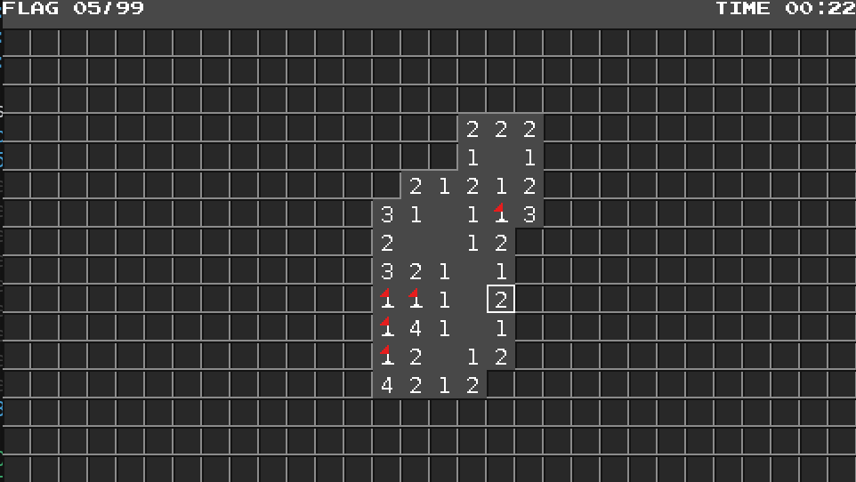

# Campo Minado PSP

Um port do jogo Campo Minado para o console PSP utilizando a framework
pspdev. Esse jogo está distribuído sob a licença GNU GPLv3.



# Compilação

O projeto é multiplataforma: para compilar em uma plataforma Linux,
basta instalar as bibliotecas:

```
sdl2
sdl2-image
sdl2-mixer
```

Depois disso, basta digitar:

```
cmake -B build
cd build && make && cd ..
./build/CampoMinadoPSP
```

Para compilar para PSP, instale a sdk pspdev adequadamente. Depois disso,
basta digitar:

```
psp-cmake -B build
cd build && make && cd ..
```

Copie o arquivo EBOOT.PBP junto com o tile.png para uma pasta no seu PSP.
Depois disso basta executar.
